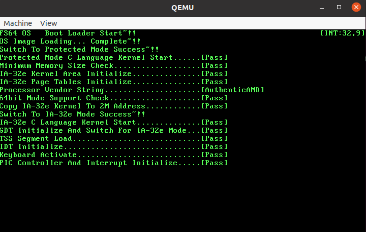
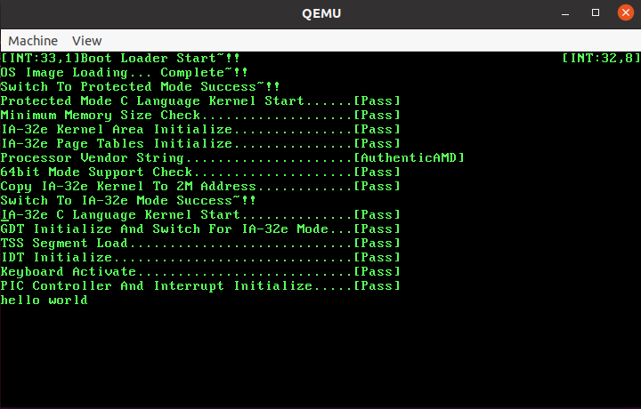

# seanOS는 MINT64 OS를 참고하여 만들어진 운영체제입니다.

## 기존의 FS64-OS 이름에서 seanOS로 이름이 변경되었습니다

---

# 사용법
```
1. make clean
2. make
3. sudo qemu-system-x86_64 -m 64 -fda ./Disk.img -rtc base=localtime -M pc
```

---

# images




---
